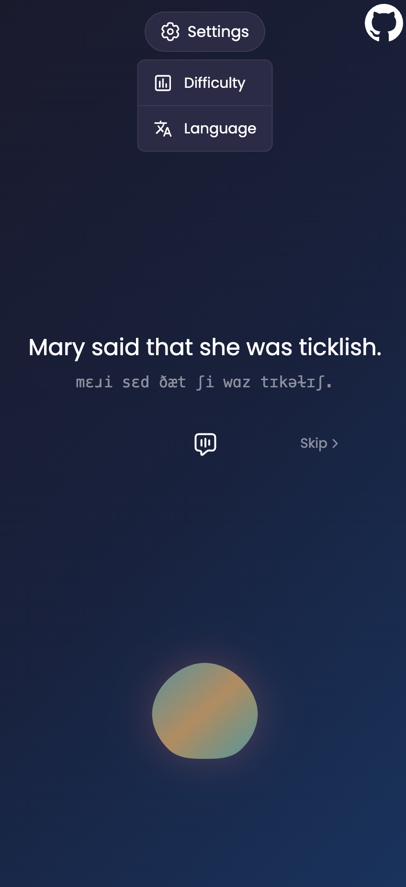

## Intro
One day I was thinking about how much I hate my accent when speaking english, and I've got a thought, what if I could use the AI to help me shape it.
The idea seemed to be very attractive and wasn't about being that awkward "AI tutor" - a soulness mannequin with uncanny valley effect, asking: "How was your day?".  

After the idea I was jumping into research of similar projects, and fortunately have found a ready-to-test gh open source repo:  
https://github.com/Thiagohgl/ai-pronunciation-trainer.  

An acoustic researcher/sciencist - [Thiago Lobato](https://www.linkedin.com/in/thiagohgl/), has built an awesome app, but with poor UI/UX, and in my head I have visualized a more beautiful
interface which I have started to develop directly.
The original repo had server side logic written on python, using AI which runs locally - absolutely cool. But looking on my nullish skills
on python and fast warming macbook air, I've decided to use beloved typescript for backend and
[MS Azure Speech Pronunciation Assessment API](https://learn.microsoft.com/en-us/azure/ai-services/speech-service/how-to-pronunciation-assessment?pivots=programming-language-javascript),
which allowed me to fully focus on the UI. 

In the end, I wasn’t fully satisfied with the accuracy of the MS Azure Speech API, but I managed to bring my UI vision to life — and I’m pretty happy about that.

[](https://accentless-client.pages.dev/)

## About
A language learning tool which record you reading sentences, analyze the pronunciation with AI and gives a detailed review.

<p align="center">
  
  
  
  
</p>

## Stack

### Client 
- **Framework:** [Solid.js](https://github.com/solidjs/solid)
- **Language:** TypeScript  
- **Styling:** TailwindCSS, Sass  

### Server
- **Framework:** [tRPC](https://trpc.io/)
- **Language:** TypeScript  
- **Validation:** Zod  
- **Speech:** microsoft-cognitiveservices-speech-sdk  

### Infrastructure
- Cloudflare Workers / Pages

## Local setup
**Prerequisites**
- MS account with API credentials (subscription key and region, [how to get it?](https://learn.microsoft.com/en-us/answers/questions/1394348/how-do-i-get-a-subscription-key))
- [Bun](https://bun.sh/) package manager installed

**Client**  
1. From project root:
``` bash
cd client
```
2. Create `.env`:
``` env
VITE_API_BASE_URL=http://localhost:8787/api
```
3. Install deps:
``` bash
bun i
```
4. Run:
``` bash
bun run dev
```

**Server**
1. From project root:
``` bash
cd server
```
2. Create `.dev.vars`:
``` env
AZURE_SUBSCRIPTION_KEY=YOUR_SUBCRIPTION_KEY
AZURE_REGION=YOUR_REGION
CLIENT_ORIGIN=http://localhost:1234
```
3. Install deps:
``` bash
bun i
``` 
5. Run:
``` bash
bun run dev
```

## Notes

> [!WARNING]
> For the moment `microsoft-cognitiveservices-speech-sdk` does not provide correct type interface for pronunciation assessment response, my implementation can be broken with time. You can track [this gh issue](https://github.com/microsoft/cognitive-services-speech-sdk-js/issues/942) which I have created about related problem.  

> [!IMPORTANT]
> As I have mentionned, MS Azure Speech API does not provide a great quality assessment for now (Summer 2025), keep that in mind.
    
